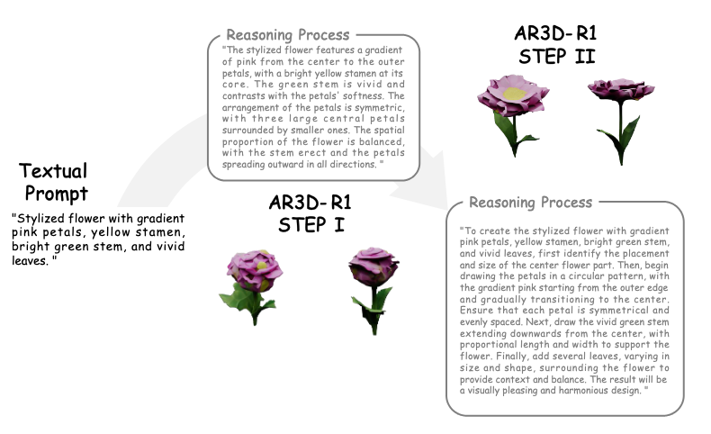

# 🌟🔥 Are We Ready for RL in Text-to-3D Generation? A Progressive Investigation

Official repository for the paper "[Are We Ready for RL in Text-to-3D Generation? A Progressive Investigation](https://arxiv.org/pdf/2512.10949)".

[[📖 Paper](https://arxiv.org/pdf/2512.10949)] [[🤗 one-step Model](https://huggingface.co/IvanTang/3DGen-R1/tree/main)]

<p align="center">
     <br>
</p>

## 💥 News
- **[2025.12.15]** AR3D-R1 \#3 paper of the day in HuggingFace Daily Papers ! 🔥
- **[2025.12.11]** We release the [checkpoint](https://huggingface.co/IvanTang/3DGen-R1/tree/main) of one-step AR3D-R1 and the inference code! 🔥
- **[2025.12.11]** We release the [arxiv paper](https://arxiv.org/pdf/2512.10949). 🔥

## 💪 Get Started
### Installation
Please set up the Python environment by:
```
conda env create -f environment.yml
conda activate environment_name

pip install -r requirements.txt
```
My environment setup is mainly based on [ShapeLLM-Omni](https://github.com/JAMESYJL/ShapeLLM-Omni). If you only need inference, installing this repository is sufficient.

## 💫 Inference   
You can download the checkpoint from [here](https://huggingface.co/IvanTang/3DGen-R1/tree/main)
```
python demo.py
```

## 💫 Evaluation with Metrics
We provide an evaluation script that supports both inference and metrics calculation:

```
python eval.py
```

**Configuration:**
- Modify the `model_path` in `eval.py` to point to your downloaded checkpoint
- The script is compatible with the inference pipeline and adds comprehensive metrics evaluation
- Supports batch evaluation on test datasets with automatic metric computation

## 👀 Qualitative result

<p align="center">
     <br>
</p>

<p align="center">
     <br>
</p>
  
## 🗒️ TODO

- [ ] Release complete two-step training & evaluation code

- [ ] Release one-step training code

## 🧠 Related Work

- **[Image Generation CoT]** [Can We Generate Images with CoT? Let's Verify and Reinforce Image Generation Step by Step?](https://arxiv.org/pdf/2501.13926)
- **[T2I-R1]** [T2I-R1: Reinforcing Image Generation with Collaborative Semantic-level and Token-level CoT](https://arxiv.org/pdf/2505.00703)
- **[ShapeLLM-Omni]** [ShapeLLM-Omni: A Native Multimodal LLM for 3D Generation and Understanding](https://arxiv.org/abs/2506.01853)
- **[Trellis]** [Structured 3D Latents for Scalable and Versatile 3D Generation](https://arxiv.org/abs/2412.01506)

## ⭐Citation
If you find AR3D-R1 useful for your research or projects, we would greatly appreciate it if you could cite the following paper:
```
@article{tang2025we,
  title={Are We Ready for RL in Text-to-3D Generation? A Progressive Investigation},
  author={Tang, Yiwen and Guo, Zoey and Zhu, Kaixin and Zhang, Ray and Chen, Qizhi and Jiang, Dongzhi and Liu, Junli and Zeng, Bohan and Song, Haoming and Qu, Delin and others},
  journal={arXiv preprint arXiv:2512.10949},
  year={2025}
}
```
